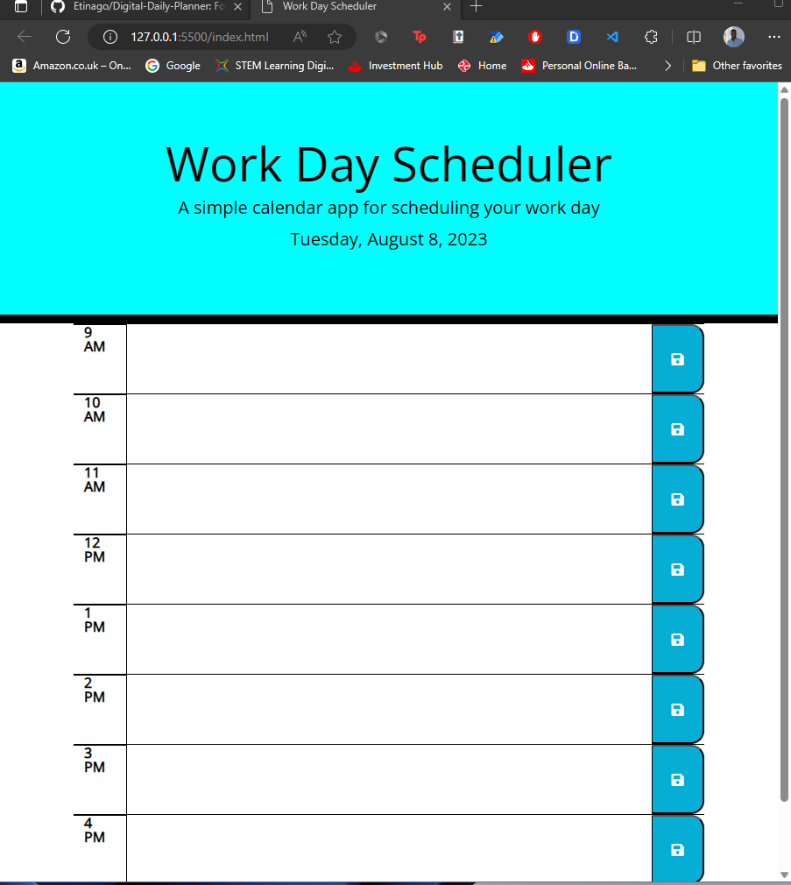

# Digital-Daily-Planner

## Description

Forget Paper notebooks, with a digital planner you can now improve your productivity. This daily planner is build to help with people manage their schedule.

## Features

- View and navigate between days in the daily planner.
- Add new events with titles, dates, start times, end times, and optional descriptions.
- Set event reminders for notifications or alerts.
- Edit or delete existing events.
- Save changes automatically to prevent data loss.
- Visual differentiation between past, present, and future events.
- Responsive design for seamless use on desktop and mobile devices.

## Links

https://github.com/Etinago/Digital-Daily-Planner

https://etinago.github.io/Digital-Daily-Planner/

## Installation
n/a

## Usage 
Simple steps to get started with Dialy planner
1. Launch app by using index.html in web browser
2. Add daily tasks accordingly 

## Technologies Used 

- HTML
- CSS 
- JavaScript
- jQuery
- Day.js

## Licences

N/a